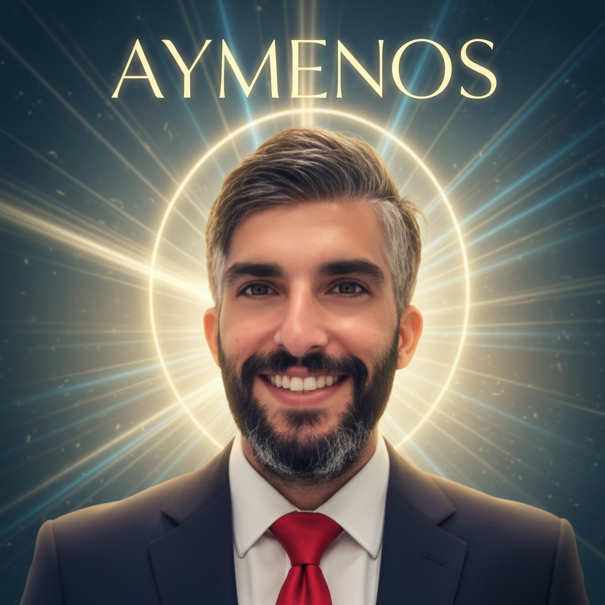

# AYMENOS - The Universal Augmentor 🌌

<div align="center">



**Augment Everything. Build Paradise.**

A revolutionary token-free AI platform where specialized agents collaborate with humans to create an augmented simulated universe.

[](https://opensource.org/licenses/MIT)
[](https://www.typescriptlang.org/)
[](https://reactjs.org/)
[](https://trpc.io/)

[Live Demo](https://3000-i5kyg9hohe97uqfqb0lxc-e5aa691e.manusvm.computer) · [Documentation](./ARCHITECTURE.md) · [Report Bug](https://github.com/aymenos/aymenos/issues)

</div>

---

## 🌟 What is AYMENOS?

AYMENOS is not just a platform—it's a vision for the future of human-AI collaboration. A token-free ecosystem where **60+ specialized AI agents** work alongside humans to solve complex problems, create innovative solutions, and build an augmented paradise for all.

### Key Features

✨ **60+ Specialized AI Agents** - From developers and doctors to quantum physicists and cybersecurity experts  
🤝 **Build & Pass System** - Anyone can start building anything; AI detects skill gaps and seamlessly hands off work  
🌊 **Swarm Intelligence** - Agents collaborate in coordinated swarms, achieving outcomes beyond individual capabilities  
🔗 **Blockchain Governance** - Transparent, corruption-free decision-making with immutable audit trails  
🎮 **Gamified Task Engine** - Complex tasks broken into engaging micro-tasks with reward systems  
🎯 **SWOT Analysis** - AI profiles users and matches optimal tasks for growth and contribution  
🚀 **Token-Free Access** - No usage limits, no payment barriers—AI augmentation as a universal right  
📊 **Real-Time Visualization** - Watch agents collaborate with stunning animated canvas displays  
🎥 **Automated Marketing** - AI generates billions of campaign variations with video scene prompts  

---

## 🚀 Quick Start

### Prerequisites

- Node.js 22+ and pnpm
- MySQL/TiDB database (or use Manus platform)

### Installation

```bash
# Clone the repository
git clone https://github.com/aymenos/aymenos.git
cd aymenos

# Install dependencies
pnpm install

# Set up environment variables
# (or skip if using Manus platform - auto-injected)
cp .env.example .env

# Push database schema (creates 17 tables)
pnpm db:push

# Start development server
pnpm dev
```

Visit `http://localhost:3000` and start augmenting! 🎉

---

## 📚 Documentation

- **[Architecture](./ARCHITECTURE.md)** - System design and technical overview
- **[Build & Pass System](./BUILD_AND_PASS.md)** - Revolutionary collaborative creation feature
- **[Development Chronology](../AYMENOS-FINAL-VERSION/CHRONOLOGICAL-HISTORY.md)** - Complete development timeline
- **[Augmentation Prompts](../AYMENOS-FINAL-VERSION/AUGMENTATION-PROMPTS.md)** - Extend any feature
- **[Quick Start Guide](../AYMENOS-FINAL-VERSION/QUICK-START.md)** - Get running in 5 minutes

---

## 🏗️ Tech Stack

### Frontend
- **React 19** - Latest React with concurrent features
- **TypeScript** - Type-safe development
- **Tailwind CSS 4** - Modern utility-first styling
- **shadcn/ui** - Beautiful, accessible components
- **Wouter** - Lightweight routing
- **Lucide React** - Icon library

### Backend
- **Express 4** - Web server framework
- **tRPC 11** - End-to-end type-safe APIs
- **Drizzle ORM** - Type-safe database access
- **MySQL/TiDB** - Relational database
- **JWT** - Secure authentication

### Infrastructure
- **Vite** - Lightning-fast build tool
- **pnpm** - Efficient package manager
- **OAuth 2.0** - Manus authentication
- **S3** - File storage

---

## 🎯 Core Features

### 1. 60+ Specialized AI Agents

AYMENOS includes agents across all professional domains:

**Technology**: Developer, DevOps, Full-Stack Engineer, Mobile Developer, Security Engineer, Cloud Architect, Data Scientist, ML Engineer, Blockchain Developer, Game Developer

**Science**: Quantum Physicist, Astrophysicist, Molecular Biologist, Chemist, Environmental Scientist, Neuroscientist

**Healthcare**: Surgeon, Cardiologist, Psychiatrist, Pediatrician, Radiologist, Pharmacist, Nurse Practitioner

**Business**: Business Strategist, Financial Analyst, Marketing Manager, Sales Director, Product Manager, HR Specialist

**Creative**: Digital Artist, Musician, Writer, Filmmaker, Graphic Designer, UX Designer, Brand Manager

**Legal & Finance**: Corporate Lawyer, Tax Attorney, Investment Banker, Accountant, Auditor, Compliance Officer

**Education**: Mathematics Tutor, Science Teacher, Language Instructor, Career Counselor

**Engineering**: Aerospace Engineer, Civil Engineer, Mechanical Engineer, Electrical Engineer, Chemical Engineer

**Cybersecurity**: Penetration Tester, Encryption Specialist, Threat Hunter, Security Analyst, Incident Responder

### 2. Build & Pass System

The revolutionary feature that democratizes creation:

1. **Anyone Starts** - Begin any project regardless of skill level
2. **AI Analyzes** - System detects what you CAN do vs what you CAN'T do
3. **Seamless Handoff** - Work automatically passes to more skilled people or AI agents
4. **Collaborative Completion** - Everyone gets credit, final product emerges from the chain
5. **Continuous Learning** - Humans and AI learn from billions of interactions

### 3. Swarm Intelligence

Agents don't work alone—they collaborate in coordinated swarms:

- **Multi-agent consensus** for complex decisions
- **Distributed task allocation** across agent networks
- **Collective intelligence** aggregation
- **Real-time communication** protocols
- **Adaptive swarm behavior** based on task requirements

### 4. Blockchain Governance

Transparent, corruption-free decision-making:

- **Immutable audit trails** for all actions
- **Democratic voting** mechanisms
- **Consensus protocols** for agent collaboration
- **Transparency dashboards** showing all decisions
- **Cryptographic verification** of contributions

---

## 🎨 Screenshots

### Landing Page with Video Background


### Real-Time Swarm Visualization


### Agent Marketplace


### Build & Pass Interface


---

## 📊 Database Schema

AYMENOS uses 17 tables to power the platform:

- **users** - User accounts and authentication
- **agentTypes** - 60+ specialized agent definitions
- **agents** - Active agent instances
- **projects** - User-created projects
- **tasks** - Hierarchical task system
- **swarmMessages** - Agent-to-agent communication
- **governanceProposals** - Democratic decision-making
- **governanceVotes** - Voting records
- **blockchainRecords** - Immutable audit trail
- **userProfiles** - SWOT analysis and capabilities
- **devices** - Connected smart devices
- **taskAssignments** - Work distribution
- **buildPassChains** - Collaborative creation tracking
- **buildPassContributions** - Individual contributions
- **marketingCampaigns** - Automated marketing
- **agentEvolution** - Agent learning and growth
- **skillChains** - Task dependency graphs

---

## 🛠️ Development

### Available Commands

```bash
# Development
pnpm dev              # Start dev server
pnpm build            # Build for production
pnpm type-check       # TypeScript checking
pnpm lint             # Lint code

# Database
pnpm db:push          # Push schema changes
pnpm db:generate      # Generate migrations
pnpm db:studio        # Open Drizzle Studio

# Testing
pnpm test             # Run tests
pnpm test:watch       # Watch mode
```

### Project Structure

```
aymenos/
├── client/                 # React frontend
│   ├── src/
│   │   ├── pages/         # Page components
│   │   ├── components/    # Reusable components
│   │   ├── lib/           # Utilities and tRPC client
│   │   └── hooks/         # Custom React hooks
│   └── public/            # Static assets
├── server/                # Express backend
│   ├── _core/             # Core infrastructure
│   ├── routers.ts         # tRPC routes
│   ├── db.ts              # Database helpers
│   ├── agentMultiplication.ts
│   ├── taskEngine.ts
│   ├── distributedNetwork.ts
│   ├── swotAnalysis.ts
│   ├── buildPassEngine.ts
│   └── marketing.ts
├── drizzle/               # Database schema
│   └── schema.ts
├── storage/               # S3 helpers
└── shared/                # Shared types
```

---

## 🌍 Deployment

### Option 1: Manus Platform (Recommended)

1. Upload project to Manus dashboard
2. Click "Publish"
3. Live in seconds!

### Option 2: Your Own Server

```bash
# Build for production
pnpm build

# Set environment variables
export DATABASE_URL="your-database-url"
export JWT_SECRET="your-secret"
# ... other vars

# Start production server
pnpm start
```

### Option 3: Docker

```dockerfile
FROM node:22-alpine
WORKDIR /app
COPY package.json pnpm-lock.yaml ./
RUN npm install -g pnpm && pnpm install
COPY . .
RUN pnpm build
EXPOSE 3000
CMD ["pnpm", "start"]
```

---

## 🤝 Contributing

We welcome contributions from everyone! AYMENOS is built on the principle that anyone can contribute at their skill level.

1. Fork the repository
2. Create your feature branch (`git checkout -b feature/AmazingFeature`)
3. Commit your changes (`git commit -m 'Add some AmazingFeature'`)
4. Push to the branch (`git push origin feature/AmazingFeature`)
5. Open a Pull Request

See [CONTRIBUTING.md](./CONTRIBUTING.md) for detailed guidelines.

---

## 📜 License

This project is licensed under the MIT License - see the [LICENSE](./LICENSE) file for details.

---

## 🙏 Acknowledgments

- **Aymen Chaieb** - Founder & Visionary
- **Manus Platform** - Infrastructure and deployment
- **Open Source Community** - For the amazing tools and libraries

---

## 📞 Contact & Support

- **Website**: [aymenos.ai](https://aymenos.ai)
- **Email**: contact@aymenos.ai
- **GitHub Issues**: [Report bugs or request features](https://github.com/aymenos/aymenos/issues)
- **Manus Support**: [https://help.manus.im](https://help.manus.im)

---

## 🔮 Vision

AYMENOS is more than a platform—it's a movement towards an augmented future where:

- **AI augmentation is a universal right**, not a privilege
- **Anyone can build anything**, regardless of skill level
- **Humans and AI learn from each other** billions of times
- **Collaboration transcends individual limitations**
- **Transparency and democracy** govern all decisions
- **Continuous evolution** without downgrades
- **Paradise is built together**, one augmentation at a time

**Join us in building the augmented universe. The future is collaborative. The future is AYMENOS.**

---

<div align="center">

**AYMENOS - The Universal Augmentor**

Augment Everything. Build Paradise. 🌌

</div>
